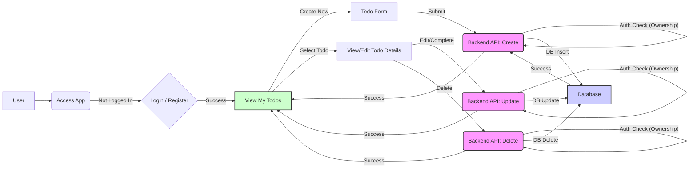

```markdown
# Todo List Application with RBAC - System Flow Document

**Version:** 1.0
**Date:** July 5, 2025

## 1. Document Header

(See above)

## 2. System Overview

This document outlines the system architecture and primary flows for a web-based Todo List application incorporating Role-Based Access Control (RBAC). The application allows users to manage personal tasks, with different access levels and capabilities defined by their assigned roles.

**Key Components:**

1.  **Frontend (Client):** The user interface (web browser application) where users interact with the system. It consumes the Backend API.
2.  **Backend (API Server):** The core application logic. It handles user requests, enforces RBAC, interacts with the database, and provides responses to the Frontend. It is stateless.
3.  **Database:** Stores all application data, including users, roles, permissions, and todo items.
4.  **Authentication/Authorization Layer:** A logical component (typically part of the Backend) responsible for verifying user identity (Authentication) and checking if a user has the necessary permissions to perform an action (Authorization).

**High-Level Interaction:**

Users interact with the Frontend, which sends requests to the Backend API. The Backend verifies the user's identity and permissions via the Authentication/Authorization layer, performs the requested operation by interacting with the Database, and sends a response back to the Frontend to update the UI.

## 3. User Workflows

This section details the primary journeys users take through the application based on their roles.

**Defined Roles:**

*   **Standard User:** Can create, view, edit, complete, and delete only *their own* todo items.
*   **Admin:** Can perform all actions of a Standard User on their own todos, *and* can view and potentially manage *all* users and *all* todo items across the system (depending on specific Admin permissions implemented, e.g., view all todos, delete any todo).

### 3.1. Standard User Workflow: Managing Own Todos

**Goal:** A Standard User successfully creates, views, updates, and deletes their personal todo items.

**Steps:**

1.  User accesses the application Frontend.
2.  User registers or logs in. (Authentication Flow)
3.  Upon successful login, the Frontend displays the user's personal todo list.
4.  User interacts with the UI to:
    *   **Create Todo:** Click "Add Todo", fill form, submit.
    *   **View Todos:** See list of *their* todos displayed.
    *   **Edit Todo:** Click on a todo, modify details, save changes.
    *   **Mark Complete:** Click checkbox/button on a todo.
    *   **Delete Todo:** Click delete button on a todo.
5.  Each action triggers an API call to the Backend.
6.  Backend verifies the user's identity and checks Authorization (e.g., "Can this user edit *this specific* todo item?"). For Standard Users, this check confirms ownership.
7.  If authorized, Backend performs the Database operation.
8.  Backend returns success/failure response.
9.  Frontend updates the UI (e.g., adds new todo, refreshes list, shows confirmation).
10. User logs out or session expires.

**Mermaid Diagram: Standard User Todo Management**



### 3.2. Admin User Workflow: Viewing All Todos

**Goal:** An Admin User successfully views todo items created by *any* user.

**Steps:**

1.  Admin User accesses the application Frontend.
2.  Admin logs in. (Authentication Flow)
3.  Upon successful login, the Frontend recognizes the Admin role (e.g., based on token data).
4.  The Admin dashboard/view includes an option or defaults to viewing *all* todo items, potentially with indicators of ownership.
5.  Admin clicks to view all todos.
6.  Frontend makes an API call to the Backend (e.g., `GET /api/todos/all`).
7.  Backend verifies the user's identity and checks Authorization (e.g., "Does this user have the 'view:any:todo' permission?"). The RBAC system determines if the user's role (Admin) grants this permission.
8.  If authorized, Backend queries the Database for *all* todo items.
9.  Database returns results.
10. Backend returns the list of all todos to the Frontend.
11. Frontend displays the list of all todos.
12. Admin may optionally perform other privileged actions (e.g., view user list, delete any todo - these would be separate workflows following similar auth/auth patterns).
13. Admin logs out or session expires.

**(Note:** A separate diagram for the Admin workflow showing *all* todos isn't strictly necessary as the diagram structure is similar to the Standard User, but the *Authorization Check* step (`Auth Check (Admin Perm)`) and the *Database Query* (`DB Query: ALL Todos`) are different.)

## 4. Data Flows

This section describes how data flows between the primary components during typical operations.

### 4.1. Data Flow: Creating a Todo Item

**Sequence:**

1.  **Frontend:** User fills out the "Create Todo" form with data (e.g., title, description, due date).
2.  **Frontend:** Serializes form data into a request body (e.g., JSON).
3.  **Frontend:** Sends an HTTP POST request to the Backend API endpoint (e.g., `/api/todos`), including the user's authentication token (e.g., JWT) in the headers.
4.  **Backend API:** Receives the request.
5.  **Backend API (Authentication):** Extracts the token from headers, validates it, and identifies the authenticated user. If invalid, returns 401 Unauthorized.
6.  **Backend API (Authorization):** Checks if the authenticated user has the permission to 'create:todo'. Since this is a standard user action, their role typically grants this. This check often implicitly links the todo ownership to the current user ID. If denied, returns 403 Forbidden.
7.  **Backend API (Validation):** Validates the request body data (e.g., required fields, data types). If invalid, returns 400 Bad Request.
8.  **Backend API (Business Logic):** Constructs the new todo object, including associating it with the authenticated user's ID.
9.  **Backend API (Database Interaction):** Executes an INSERT query into the `todos` table in the Database with the new todo data.
10. **Database:** Stores the new todo record and returns a success confirmation (e.g., the new todo's ID, timestamp).
11. **Backend API:** Receives the database confirmation. Formats a success response (e.g., HTTP 201 Created, with the new todo object in the body).
12. **Backend API:** Sends the HTTP response back to the Frontend.
13. **Frontend:** Receives the response. If successful (201/200), updates the UI (e.g., adds the new todo to the list, shows a success message). If an error (4xx, 5xx), displays an error message.

**Mermaid Diagram: Create Todo Data Flow**

```mermaid
graph LR
    A[Frontend UI] --> B{HTTP POST /api/todos};
    B --> C[Backend API];
    C --> D{Authenticate User};
    D -- Valid User --> E{Authorize Action: create:todo};
    E -- Permitted --> F{Validate Request Data};
    F -- Valid Data --> G[Prepare Todo Data (Attach User ID)];
    G --> H{DB Query: INSERT into todos};
    H --> I[Database];
    I -- Success --> H;
    H -- Success --> K[Backend API: Format Response (201 Created)];
    K --> L{HTTP Response};
    L --> A;

    D -- Invalid User --> M[Backend API: 401 Unauthorized];
    M --> L;
    E -- Not Permitted --> N[Backend API: 403 Forbidden];
    N --> L;
    F -- Invalid Data --> O[Backend API: 400 Bad Request];
    O --> L;
    H -- Error --> P[Backend API: 500 Internal Server Error];
    P --> L;

    style C fill:#f9f,stroke:#333,stroke-width:2
    style G fill:#f9f,stroke:#333,stroke-width:2
    style K fill:#f9f,stroke:#333,stroke-width:2
    style M fill:#f9f,stroke:#333,stroke-width:2
    style N fill:#f9f,stroke:#333,stroke-width:2
    style O fill:#f9f,stroke:#333,stroke-width:2
    style P fill:#f9f,stroke:#333,stroke-width:2
    style I fill:#ccf,stroke:#333,stroke-width:2
```

**(Note:** Data flows for viewing, updating, and deleting todos follow a similar pattern, but the specific HTTP method (GET, PUT/PATCH, DELETE) and the Authorization check (`read:own:todo`, `update:own:todo`, `delete:own:todo` for Standard User, or `read:any:todo`, `update:any:todo`, `delete:any:todo` for Admin) and database query differ.)

## 5. Error Handling

Robust error handling is crucial for a good user experience and system stability.

**Strategies:**

1.  **Frontend:**
    *   Display user-friendly error messages for various scenarios (e.g., "Invalid credentials", "You don't have permission", "Could not save todo, please try again").
    *   Handle network errors gracefully (e.g., show connection error, allow retries).
    *   Implement client-side validation where possible for immediate feedback (though server-side validation is mandatory).
2.  **Backend API:**
    *   **Input Validation:** Validate all incoming request data (e.g., format, presence, length). Return 400 Bad Request for validation errors.
    *   **Authentication Errors:** Return 401 Unauthorized for missing, invalid, or expired credentials/tokens.
    *   **Authorization Errors:** Return 403 Forbidden when an authenticated user attempts an action they lack permission for.
    *   **Resource Not Found:** Return 404 Not Found when a requested resource (e.g., a specific todo ID) does not exist or is not accessible to the user.
    *   **Internal Server Errors:** Catch unexpected errors (database connection issues, unhandled exceptions, etc.) and return 500 Internal Server Error. Avoid exposing sensitive details in the response body in production. Log the full error on the server.
    *   Use consistent error response formats (e.g., JSON objects with an `error` key, a descriptive message, and potentially an error code).
3.  **Database:**
    *   Configure appropriate constraints (e.g., NOT NULL, foreign keys) to maintain data integrity.
    *   Handle potential database errors (connection issues, query timeouts) within the Backend logic.
4.  **Logging and Monitoring:**
    *   Implement comprehensive server-side logging (structured logs preferred) for all errors, warnings, and significant events (like failed login attempts, authorization failures).
    *   Set up monitoring and alerting for key metrics and error rates (e.g., 5xx error rate spikes).

**Examples of Handled Errors:**

*   User tries to create a todo with an empty title (400 Bad Request).
*   User tries to access an API endpoint without logging in (401 Unauthorized).
*   Standard User tries to delete a todo item belonging to another user (403 Forbidden).
*   User tries to edit a todo that doesn't exist (404 Not Found).
*   Database server is down (500 Internal Server Error).

## 6. Security Flows

Security is paramount, especially with RBAC. This section covers Authentication and Authorization.

### 6.1. Authentication Flow (Login)

**Goal:** Verify the user's identity.

**Steps:**

1.  **Frontend:** User submits login credentials (username/email and password).
2.  **Frontend:** Sends an HTTP POST request to the Backend API login endpoint (e.g., `/api/login`) with credentials in the request body.
3.  **Backend API:** Receives credentials.
4.  **Backend API:** Queries the Database for the user record based on username/email.
5.  **Database:** Returns user record (including hashed password and associated role ID).
6.  **Backend API:**
    *   If user not found, returns 401 Unauthorized.
    *   If user found, retrieves stored hashed password.
    *   Uses a secure hashing algorithm (e.g., bcrypt, scrypt) to hash the submitted password and compares it to the stored hash.
7.  **Backend API (Success):** If passwords match:
    *   Generates a secure authentication token (e.g., JWT). The token payload includes essential user information, crucially the user's ID and role identifier(s). Avoid putting sensitive data like passwords or permissions *directly* in the token payload (permissions can be dynamic).
    *   Returns the token to the Frontend, typically in the response body or a secure HTTP-only cookie. Includes user ID and role(s) in the response body if using token in local storage.
8.  **Backend API (Failure):** If passwords don't match, returns 401 Unauthorized (or 400 Bad Request to be less specific and avoid leaking user existence).
9.  **Frontend:** Receives the token. Stores it securely (e.g., HttpOnly cookie or Local Storage, with considerations for XSS risks if using Local Storage). Redirects user to the main application area (e.g., Dashboard/Todo List).
10. **Frontend:** For subsequent requests requiring authentication, includes the token in the HTTP `Authorization` header (e.g., `Bearer [token]`).

### 6.2. Authorization Flow (RBAC Enforcement)

**Goal:** Determine if an *authenticated* user is allowed to perform a specific action on a specific resource.

**Steps:**

1.  **Frontend:** User performs an action (e.g., clicks "Delete" on a todo, accesses the "Admin Users" page).
2.  **Frontend:** Sends an HTTP request to the Backend API, including the authentication token.
3.  **Backend API:** Receives the request and the token.
4.  **Backend API (Authentication):** Validates the token and extracts the user's identity and associated role(s) from the token payload. If invalid/expired, the Authentication flow handles this (returns 401).
5.  **Backend API (Authorization Layer/Middleware):**
    *   Identifies the requested action (e.g., DELETE /api/todos/{id}, GET /api/admin/users).
    *   Determines the required permission(s) for this action (e.g., `delete:own:todo`, `read:any:user`). This mapping is configured in the backend logic based on the API route and HTTP method.
    *   Looks up the permissions associated with the authenticated user's role(s) (potentially fetching permissions from the Database based on the role ID from the token, or if permissions are relatively static, loading them into memory on startup).
    *   For resource-specific checks (like editing/deleting a specific todo), retrieves the resource from the Database to check ownership or other attributes (e.g., get the todo with `{id}`, check if `todo.ownerId === userId`). This is often called "Attribute-Based Access Control" (ABAC) complementing the RBAC by adding context.
6.  **Backend API (Decision Point):**
    *   If the user's role(s) have the required permission(s) *AND* any necessary resource-specific conditions are met, the request is **authorized**. The Backend proceeds with the business logic and Database interaction.
    *   If permissions are insufficient or conditions are not met, the request is **denied**. The Backend immediately returns a 403 Forbidden response.
7.  **Frontend:** Receives the response (either the result of the authorized action or the 403 Forbidden error) and updates the UI accordingly (e.g., shows success message, removes item, or displays an error message "You don't have permission to do that").

**Principle of Least Privilege:**

The system should be designed so that users (and roles) are only granted the minimum permissions necessary to perform their required tasks. Standard Users should not have access to Admin API endpoints or functionality. The Backend must *never* trust the Frontend regarding user roles or permissions; all authorization decisions must be made on the server-side after authenticating the user and checking their actual, assigned role(s) and corresponding permissions.

This comprehensive plan covers the core requirements, user interaction flows, data handling, error management, and critical security considerations for building an RBAC-enabled Todo List application using modern development principles.
```
