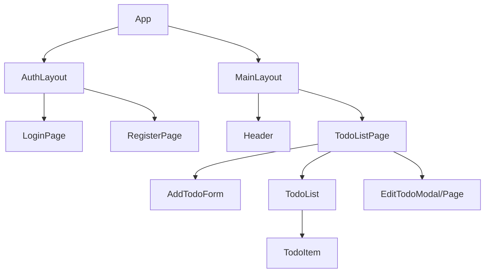

```markdown
# TODO List Application with Role-Based Access Control (RBAC) - Frontend Implementation Guide

**Version: 1.0**
**Date: July 5, 2025**

This document outlines the frontend implementation plan for a TODO list application incorporating Role-Based Access Control (RBAC). It covers core components, state management, UI considerations, API integration, testing, and provides practical code examples.

## 1. Document Header

(See above)

## 2. Component Architecture

The application will follow a component-based architecture, likely using a framework like React, Vue, or Angular. For this guide, we will use React with TypeScript for clarity and type safety.

The core components and their relationships are as follows:

*   **App:** The root component. Handles routing and initial setup.
*   **AuthLayout:** A layout component for authentication pages (Login, Register).
*   **MainLayout:** A layout component for authenticated users (Header, main content area).
*   **LoginPage:** Component for user login.
*   **RegisterPage:** Component for user registration (optional, depending on backend user management).
*   **TodoListPage:** The main page displaying the TODO list.
*   **Header:** Displays app title, user info, and logout button. Access to user role might influence displayed info or actions.
*   **AddTodoForm:** A form for adding new TODOs. Availability might depend on user role.
*   **TodoList:** A container component rendering the list of `TodoItem`s. Handles filtering/sorting logic if needed.
*   **TodoItem:** Displays a single TODO item. Includes title, description, status, and action buttons (edit, delete, toggle complete).
*   **EditTodoModal/Page:** A modal or separate page for editing an existing TODO.
*   **PermissionWrapper:** A higher-order component or hook to conditionally render content based on user permissions.

**Relationships:**



**RBAC Impact on Components:**

*   `Header`: Might show user role.
*   `AddTodoForm`: May be hidden for roles without 'create' permission.
*   `TodoItem`: Edit/Delete/Toggle buttons are conditionally rendered based on user role *and* potentially todo ownership.
*   `TodoListPage`: May filter which todos are displayed based on role (e.g., only show 'owned' todos or all todos).
*   `EditTodoModal/Page`: Access restricted if user doesn't have 'update' permission for that specific todo.
*   `PermissionWrapper`: Used throughout to protect UI elements.

## 3. State Management

Application state can be managed using a combination of component local state (`useState`) and a global state management solution. Given the need to share user authentication status (including role and permissions) and the list of TODOs across different parts of the application, a global state manager is recommended.

**Recommended Global State Manager:**

*   **Zustand:** A lightweight, fast, and scalable state management solution. Simple API similar to React hooks.
*   **Recoil / Jotai:** Atom-based solutions, good for deriving state and managing complex dependencies.
*   **React Context + useReducer:** Suitable for smaller applications or where state updates are localized.

For this guide, we will illustrate using **Zustand**.

**Key State Slices:**

1.  **Auth State:**
    *   `user`: User object (`{ id, username, role, permissions }`).
    *   `isAuthenticated`: Boolean.
    *   `isLoading`: Boolean (for login/auth check).
    *   `error`: String or null.
    *   `login(credentials)`: Action to handle login.
    *   `logout()`: Action to handle logout.
    *   `checkAuth()`: Action to verify token/session on app load.
    *   `hasPermission(permissionKey)`: Helper function/selector to check if the logged-in user has a specific permission.

2.  **Todo State:**
    *   `todos`: Array of Todo objects (`{ id, title, description, completed, ownerId }`).
    *   `isLoading`: Boolean (for fetching todos).
    *   `error`: String or null.
    *   `addTodo(todoData)`: Action to add a todo.
    *   `updateTodo(todoId, todoData)`: Action to update a todo.
    *   `deleteTodo(todoId)`: Action to delete a todo.
    *   `fetchTodos()`: Action to fetch todos from the API.

**Permissions Structure:**

Permissions will likely be strings or keys provided by the backend within the user object upon login or during an auth check (`/auth/me`).

Example `user` object structure from API:

```json
{
  "id": "user-123",
  "username": "johndoe",
  "role": "standard_user",
  "permissions": [
    "todo:create",
    "todo:read:own",
    "todo:update:own",
    "todo:delete:own",
    "todo:toggle_complete:own"
  ]
}
```

Example Admin user:

```json
{
  "id": "admin-456",
  "username": "administrator",
  "role": "admin",
  "permissions": [
    "todo:create",
    "todo:read:any",
    "todo:update:any",
    "todo:delete:any",
    "todo:toggle_complete:any",
    "user:manage" // Example of another permission
  ]
}
```

The `hasPermission` selector in the auth store is crucial for RBAC enforcement in the UI.

## 4. UI Design

**Layout:**

*   A consistent header across authenticated pages.
*   Main content area displaying the TODO list and potentially the add form.
*   Use of a modal or separate page for editing keeps the main list view clean.
*   Consistent styling for buttons, forms, and list items.

**Key Interactions & RBAC Implications:**

*   **Login:** Simple form validation. Redirect to TodoListPage on success. Handle API errors (e.g., incorrect credentials).
*   **Add TODO:** Input field(s) and a submit button. The form/button is hidden if the user lacks `todo:create` permission.
*   **View TODOs:** Display list items.
*   **Edit TODO:** A button next to the item. Button is disabled/hidden if the user lacks `todo:update:own` (and it's their todo) or `todo:update:any` permission. Clicking opens the edit modal/page.
*   **Delete TODO:** A button next to the item. Button is disabled/hidden if the user lacks `todo:delete:own` (and it's their todo) or `todo:delete:any` permission. May require a confirmation step.
*   **Toggle Complete:** A checkbox or button. Disabled/hidden if the user lacks `todo:toggle_complete:own` (and it's their todo) or `todo:toggle_complete:any` permission.
*   **Unauthorized Access:** If a user tries to access a route they don't have permission for, redirect them (e.g., to login or a 403 Forbidden page).
*   **Action Forbidden:** If a user *sees* a button but the backend denies the action (e.g., due to a race condition or more granular backend check), display an informative error message.

**Visual Cues:**

*   Loading spinners/skeletons during API calls.
*   Clear error messages for form validation and API failures.
*   Visual distinction for completed TODOs.
*   Disable buttons instead of hiding if the action is temporarily unavailable (e.g., while saving). Hide if the action is permanently unavailable based on role/permission.

**Responsiveness:**

*   Design should be mobile-first or adaptive to various screen sizes.
*   Use flexible layouts (Flexbox, Grid).

**Accessibility:**

*   Use semantic HTML.
*   Ensure keyboard navigation is possible.
*   Provide ARIA attributes where necessary, especially for dynamic content or custom controls.

## 5. API Integration

The frontend will communicate with a backend API using HTTP requests.

**Base URL:** Configure a base URL for API calls (e.g., `/api/v1` or `https://your-backend.com/api/v1`).

**Authentication:**

*   Upon successful login (`POST /auth/login`), the backend should return a token (e.g., JWT) and user information, including the user's role and a list of their effective permissions.
*   Store the token securely (e.g., in `localStorage` or `sessionStorage`).
*   Include the token in an `Authorization: Bearer [token]` header for all subsequent authenticated requests.
*   Implement an API interceptor (using libraries like `axios` interceptors or a custom `fetch` wrapper) to automatically add the Authorization header and handle token expiration (e.g., redirect to login on 401 Unauthorized).
*   An endpoint like `GET /auth/me` is useful to fetch user info and permissions on app load or refresh.

**TODO Endpoints:**

*   `GET /todos`: Fetch all accessible TODOs. The backend determines which TODOs are returned based on the user's role and `read` permission (e.g., `todo:read:own` vs `todo:read:any`).
*   `POST /todos`: Create a new TODO. Request body includes todo details. Backend validates `todo:create` permission.
*   `GET /todos/:id`: Fetch a specific TODO. Backend validates `todo:read:own`/`any` permission for the requested ID.
*   `PUT /todos/:id`: Update a specific TODO. Request body includes updated details. Backend validates `todo:update:own`/`any` permission and ownership if applicable.
*   `DELETE /todos/:id`: Delete a specific TODO. Backend validates `todo:delete:own`/`any` permission and ownership if applicable.
*   `PATCH /todos/:id/complete`: Toggle completion status. Request body might be `{ completed: boolean }`. Backend validates `todo:toggle_complete:own`/`any` permission and ownership if applicable.

**RBAC Enforcement (Frontend vs. Backend):**

It is crucial that the **backend is the ultimate authority** for RBAC. The frontend's role is to:
1.  Fetch the user's permissions from the backend.
2.  Conditionally render UI elements (buttons, forms) based on these permissions.
3.  Send action requests to the backend.

The backend *must* re-validate the user's permissions for *every* action request (create, update, delete, etc.) before executing it. The frontend simply provides a better user experience by preventing users from *trying* actions they definitely can't do, but malicious users could bypass frontend checks.

**Error Handling:**

*   Handle network errors.
*   Handle HTTP status codes:
    *   `401 Unauthorized`: Token is missing or invalid. Redirect to login.
    *   `403 Forbidden`: User is authenticated but does not have permission for the requested action/resource. Display a specific error message (e.g., "You don't have permission to do that.").
    *   `404 Not Found`: Resource doesn't exist.
    *   `400 Bad Request`: Validation errors (show form errors).
    *   `500 Internal Server Error`: Generic server error.

## 6. Testing Approach

A multi-layered testing strategy ensures application quality and reliability, especially for RBAC logic.

*   **Unit Tests:**
    *   Test individual components in isolation (using React Testing Library). Verify rendering based on props and state, event handling.
    *   Test custom hooks (e.g., a `usePermissions` hook).
    *   Test state management logic (actions, reducers/setters, selectors).
    *   Test utility functions (e.g., API request wrapper).
    *   *RBAC Focus:* Test that components correctly hide/show elements when different permission props/context values are provided. Test `hasPermission` selector logic.

*   **Integration Tests:**
    *   Test interactions between components (e.g., submitting the AddTodoForm correctly calls an API action).
    *   Test state updates triggered by component interactions or API responses (mocking API calls).
    *   Test routing and protected routes.
    *   *RBAC Focus:* Test that clicking a seemingly available button (frontend allows) results in the correct API call, and how the UI handles a `403 Forbidden` response from a mocked API. Test that protected routes (like `/todos`) redirect unauthorized users.

*   **End-to-End (E2E) Tests:**
    *   Test complete user flows using tools like Cypress or Playwright.
    *   Simulate user actions across multiple pages (Login -> View TODOs -> Add TODO -> Edit TODO -> Delete TODO).
    *   *RBAC Focus:* **Crucial for verifying RBAC.**
        *   Test login with different user roles (Admin, Standard User, Viewer).
        *   As Admin, verify ability to see/edit/delete any todo.
        *   As Standard User, verify ability to see/edit/delete *only* their own todos, and that buttons for other users' todos are hidden or disabled. Verify that attempting to access/modify another user's todo via direct URL or manipulating frontend state fails gracefully (showing error message) when the backend returns 403.
        *   As Viewer, verify ability to see todos (potentially filtered), and that Add/Edit/Delete buttons are absent.
        *   Test logout.

**Testing Tools:**

*   Jest: Test runner.
*   React Testing Library (RTL): For unit and integration tests focusing on user interaction.
*   MSW (Mock Service Worker) or similar: For mocking API calls in integration tests.
*   Cypress or Playwright: For E2E tests.

## 7. Code Examples

These examples use React with TypeScript and Zustand for state management.

### Example 1: Zustand Auth Store with Permissions

```typescript
// src/store/authStore.ts
import { create } from 'zustand';

type Role = 'admin' | 'standard_user' | 'viewer' | 'guest'; // Define your roles
type Permission = string; // e.g., 'todo:create', 'todo:read:own', 'todo:delete:any'

interface User {
  id: string;
  username: string;
  role: Role;
  permissions: Permission[];
}

interface AuthState {
  user: User | null;
  isAuthenticated: boolean;
  isLoading: boolean;
  error: string | null;
  login: (credentials: any) => Promise<void>;
  logout: () => void;
  checkAuth: () => Promise<void>;
  hasPermission: (permissionKey: Permission) => boolean;
}

const useAuthStore = create<AuthState>((set, get) => ({
  user: null,
  isAuthenticated: false,
  isLoading: true, // Assume loading on initial app load
  error: null,

  // Action to handle login
  login: async (credentials) => {
    set({ isLoading: true, error: null });
    try {
      // Replace with your actual API call
      const response = await fetch('/api/auth/login', {
        method: 'POST',
        headers: { 'Content-Type': 'application/json' },
        body: JSON.stringify(credentials),
      });

      if (!response.ok) {
        const err = await response.json();
        throw new Error(err.message || 'Login failed');
      }

      const data = await response.json();
      // Assuming backend returns { token, user: { id, username, role, permissions } }
      localStorage.setItem('authToken', data.token);
      set({ user: data.user, isAuthenticated: true, isLoading: false });

    } catch (err: any) {
      set({ user: null, isAuthenticated: false, error: err.message, isLoading: false });
      localStorage.removeItem('authToken'); // Ensure no invalid token is stored
    }
  },

  // Action to handle logout
  logout: () => {
    localStorage.removeItem('authToken');
    set({ user: null, isAuthenticated: false });
    // Optionally, redirect to login page here or in a component using the state change
  },

  // Action to check auth status on app load
  checkAuth: async () => {
    set({ isLoading: true, error: null });
    const token = localStorage.getItem('authToken');
    if (!token) {
      set({ user: null, isAuthenticated: false, isLoading: false });
      return;
    }

    try {
      // Replace with your actual API call to validate token and get user info
      const response = await fetch('/api/auth/me', {
        headers: { 'Authorization': `Bearer ${token}` },
      });

      if (!response.ok) {
        // Token invalid or expired
        throw new Error('Authentication failed');
      }

      const data = await response.json();
       // Assuming backend returns { id, username, role, permissions }
      set({ user: data, isAuthenticated: true, isLoading: false });

    } catch (err: any) {
      set({ user: null, isAuthenticated: false, error: 'Session expired. Please log in.', isLoading: false });
      localStorage.removeItem('authToken'); // Clear invalid token
       // Optionally, redirect to login page here
    }
  },

  // Selector/Helper function to check permissions
  hasPermission: (permissionKey) => {
    const { user } = get();
    if (!user) return false; // Not authenticated, no permissions

    // Basic check if the user has the specific permission key
    // More complex logic can be added here (e.g., role hierarchy, resource ownership checks)
    return user.permissions.includes(permissionKey);
  },
}));

export default useAuthStore;
```

### Example 2: Protecting a Route

Using React Router v6 and the auth store.

```typescript
// src/components/ProtectedRoute.tsx
import React from 'react';
import { Navigate, Outlet } from 'react-router-dom';
import useAuthStore from '../store/authStore';
import LoadingSpinner from './LoadingSpinner'; // Assume you have a loading component

interface ProtectedRouteProps {
  // Define props if needed, e.g., requiredRole or requiredPermissions
}

const ProtectedRoute: React.FC<ProtectedRouteProps> = () => {
  const { isAuthenticated, isLoading } = useAuthStore();

  if (isLoading) {
    // Show a loading indicator while checking auth status
    return <LoadingSpinner />;
  }

  if (!isAuthenticated) {
    // Redirect to login if not authenticated
    return <Navigate to="/login" replace />;
  }

  // If authenticated, render the child routes/components
  return <Outlet />;
};

export default ProtectedRoute;
```

```typescript
// src/App.tsx
import React, { useEffect } from 'react';
import { BrowserRouter as Router, Routes, Route, Navigate } from 'react-router-dom';
import useAuthStore from './store/authStore';
import LoginPage from './pages/LoginPage';
import TodoListPage from './pages/TodoListPage';
import ProtectedRoute from './components/ProtectedRoute';
import MainLayout from './components/MainLayout'; // Your layout component

function App() {
  const checkAuth = useAuthStore((state) => state.checkAuth);
  const isLoading = useAuthStore((state) => state.isLoading);

  useEffect(() => {
    checkAuth(); // Check auth status on app mount
  }, [checkAuth]);

  // You might want a global loading state here
  if (isLoading) {
     // Render a full-page loading spinner while the initial auth check happens
     return <div>Loading Application...</div>; // Replace with a proper spinner component
  }

  return (
    <Router>
      <Routes>
        {/* Public routes */}
        <Route path="/login" element={<LoginPage />} />

        {/* Protected routes */}
        <Route element={<ProtectedRoute />}>
          <Route element={<MainLayout />}> {/* Use layout for protected routes */}
             <Route path="/" element={<Navigate to="/todos" replace />} />
             <Route path="/todos" element={<TodoListPage />} />
             {/* Add other protected routes here */}
          </Route>
        </Route>

        {/* Catch-all or 404 page */}
        <Route path="*" element={<div>404 Not Found</div>} />
      </Routes>
    </Router>
  );
}

export default App;
```

### Example 3: RBAC Logic in TodoItem Component

This component conditionally renders buttons based on the user's permissions and whether they own the todo item.

```typescript
// src/components/TodoItem.tsx
import React from 'react';
import useAuthStore from '../store/authStore'; // Import the auth store
import { Todo } from '../types'; // Assume you have a Todo type
import { useTodoStore } from '../store/todoStore'; // Assume you have a Todo store actions

interface TodoItemProps {
  todo: Todo;
}

const TodoItem: React.FC<TodoItemProps> = ({ todo }) => {
  const { user, hasPermission } = useAuthStore();
  const { updateTodo, deleteTodo } = useTodoStore(); // Actions from your Todo store

  // Determine if the logged-in user is the owner of this todo
  const isOwner = user?.id === todo.ownerId;

  // Check specific permissions based on ownership
  const canEdit = (isOwner && hasPermission('todo:update:own')) || hasPermission('todo:update:any');
  const canDelete = (isOwner && hasPermission('todo:delete:own')) || hasPermission('todo:delete:any');
  const canToggleComplete = (isOwner && hasPermission('todo:toggle_complete:own')) || hasPermission('todo:toggle_complete:any');

  const handleToggleComplete = () => {
    if (canToggleComplete) {
      updateTodo(todo.id, { completed: !todo.completed }); // Assuming updateTodo handles API call
    } else {
       alert("You don't have permission to toggle completion for this item."); // Or display a non-intrusive message
    }
  };

  const handleEdit = () => {
     if (canEdit) {
       // Trigger modal or navigate to edit page
       console.log(`Editing todo ${todo.id}`);
       // Example: openEditModal(todo.id);
     } else {
       alert("You don't have permission to edit this item.");
     }
  };

  const handleDelete = () => {
    if (canDelete) {
      if (window.confirm(`Are you sure you want to delete "${todo.title}"?`)) {
         deleteTodo(todo.id); // Assuming deleteTodo handles API call
      }
    } else {
      alert("You don't have permission to delete this item.");
    }
  };

  return (
    <div style={{ border: '1px solid #ccc', margin: '10px', padding: '10px' }}>
      <input
        type="checkbox"
        checked={todo.completed}
        onChange={handleToggleComplete}
        disabled={!canToggleComplete} // Disable the checkbox if no permission
      />
      <span style={{ textDecoration: todo.completed ? 'line-through' : 'none' }}>
        {todo.title}
      </span>
      <p>{todo.description}</p>
      <small>Owner: {todo.ownerId} (You: {user?.id})</small> {/* For debugging */}

      {/* Conditionally render buttons based on calculated permissions */}
      {canEdit && (
        <button onClick={handleEdit} style={{ marginLeft: '10px' }}>Edit</button>
      )}
      {canDelete && (
        <button onClick={handleDelete} style={{ marginLeft: '10px' }}>Delete</button>
      )}
       {!canEdit && !canDelete && !canToggleComplete && (
           <span style={{ marginLeft: '10px', color: '#888' }}>View Only</span>
       )}
    </div>
  );
};

export default TodoItem;
```

### Example 4: Protecting the Add Todo Form

Hide the form if the user doesn't have the `todo:create` permission.

```typescript
// src/components/AddTodoForm.tsx
import React, { useState } from 'react';
import useAuthStore from '../store/authStore';
import { useTodoStore } from '../store/todoStore';

const AddTodoForm: React.FC = () => {
  const { hasPermission } = useAuthStore();
  const { addTodo } = useTodoStore(); // Action from your Todo store

  const [title, setTitle] = useState('');
  const [description, setDescription] = useState('');

  const canCreateTodo = hasPermission('todo:create');

  const handleSubmit = (e: React.FormEvent) => {
    e.preventDefault();
    if (!canCreateTodo) {
       alert("You don't have permission to create todos.");
       return;
    }
    if (!title.trim()) {
      alert('Title is required');
      return;
    }
    addTodo({ title, description }); // Assuming addTodo handles API call and state update
    setTitle('');
    setDescription('');
  };

  // Render the form only if the user has permission
  if (!canCreateTodo) {
    return <p>You do not have permission to add new todos.</p>;
  }

  return (
    <form onSubmit={handleSubmit} style={{ margin: '20px 0', padding: '15px', border: '1px dashed #ddd' }}>
      <h3>Add New Todo</h3>
      <div>
        <label>Title:</label>
        <input
          type="text"
          value={title}
          onChange={(e) => setTitle(e.target.value)}
          required
        />
      </div>
      <div style={{ marginTop: '10px' }}>
        <label>Description:</label>
        <textarea
          value={description}
          onChange={(e) => setDescription(e.target.value)}
        />
      </div>
      <button type="submit" style={{ marginTop: '10px' }}>Add Todo</button>
    </form>
  );
};

export default AddTodoForm;
```

These examples demonstrate how to integrate RBAC checks directly into your components and state management, making the UI responsive to user permissions received from the backend. Remember to always validate actions on the backend as well.
```
